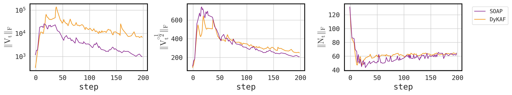
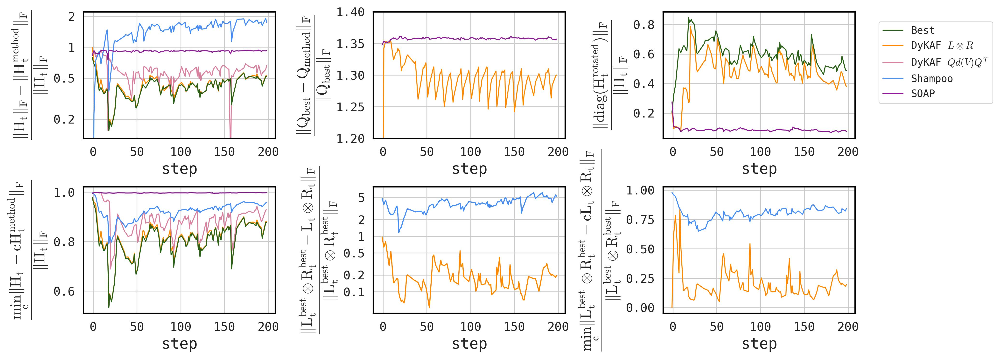

# DyKAF: Dynamical Kronecker Approximation of the Fisher Information Matrix for Gradient Preconditioning

The figure compares norms of second moments and updates of DyKAF and SOAP.

## Updated Figure 1 and 2

## New CIFAR 10 time experiments

Main optimizer: `./src/optimizers/dykaf.py`

Syntetic experiments: `./src/libsvm/`

Fine-tuning experiments: `./src/fine_tuning/`

Pre-training: implement DyKAF from `./src/optimizers/dykaf.py` into pretrain optimization [LIB](https://github.com/epfml/llm-baselines/tree/soap)